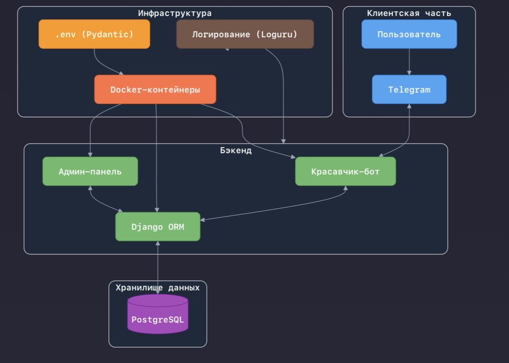

   
<hr />
<br>


## Описание

**[DigitalStore](https://t.me/almir_test_bot) 🛍️ представляет собой современное веб-приложение, построенное на основе микросервисной архитектуры с использованием [Django](https://ru.wikipedia.org/wiki/Django). Система разделена на логические компоненты, обеспечивающие эффективное взаимодействие между [Telegram-ботом](https://ru.wikipedia.org/wiki/Telegram) 🤖 и базой данных.**

**Макеты были созданы в Figma + Photoshop. Реализация выполненыа с использованием Django, aiogram 3.**

## Демо-версия 
[Demo-version](https://github.com/user-attachments/assets/3980b1c8-1ae7-4705-9139-76268a590113)

## Схема



## Функционал 

#### Клиентская часть включает в себя следующие возможности:

- **Каталог** — Просмотр товаров с детальными описаниями и фильтрацией по различным параметрам.
- **Корзина** — Удобный интерфейс для добавления, удаления товаров и оформления покупок.
- **FAQ** — Раздел с часто задаваемыми вопросами для быстрого поиска ответов на популярные вопросы.
- **Бонуска** — раздел, созданный исключительно для юмора и хорошего настроения.

#### Серверная часть (Бэкенд) представляет следующее:

- **Административная панель** — Просмотр товаров, корзин, заказов и списка пользователей.
- **Рассылки пользователям** — Отправка сообщений пользователям для уведомлений или маркетинговых целей.
- **Загрузка заказов пользователей в формат XLSX** — Возможность загрузки всех совершённых заказов пользователей для дальнейшей обработки или анализа.
- **Проверка подписок пользователей** — Система для проверки и управления подписками пользователей на сервис.

## Инструкция по запуску

1. Скопировать файлы проекта

```commandline
git clone https://github.com/Nolucker391/DigitalStore-aiogram-django.git
```

2. Создать переменные окружения .env с параметрами:

```commandline
BOT_TOKEN = str
(для оплаты) PAYMENT_TOKEN = str
```

3. Запуск проекта

```commandline
docker-compose up     
```
## Инструменты разработки

| Библиотека           | Версия |
|----------------------|--------|
| aiogram              | `3.18.0` |
| dj-database-url      | `2.3.0` |
| Docker               | `27.3.1` |
| PostgreSQL           | `17.4`  |
| Django               | `5.1.6` |
| openpyxl             | `3.1.5`  |
| pillow               | `11.1.0` |
| pydantic             | `2.10.6` |


